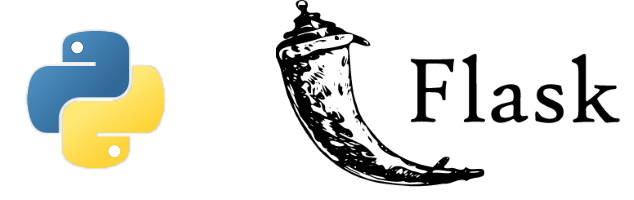

# Flask Web App Example

## Description

This is a simple example of a web application built with Flask, a micro web framework for Python. The application displays a basic webpage with the message "Hello, Flask!".

## Features

- Single route that renders a webpage with a greeting message.
- Uses Flask templates to dynamically display content.

## How to Run

1. Make sure you have Python installed on your system.
2. Install Flask using `pip install flask`.
3. Run the script `app.py`.
4. Open a web browser and go to [http://localhost:5000](http://localhost:5000) to view the application.

Feel free to explore, modify, and expand the code to suit your project needs!

## License

This project is licensed under the MIT License - see the [LICENSE](LICENSE) file for details.
